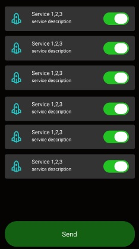

# H2G (Health 2 Game) Mobile Connector

Project stays in the active phaze of development. Android platform was chosen as a main test stand.

## Description
Client concept approximately looks:

## Architecture

Simplified version of app architecture is shown below. The key difference here is approach to get sensor data.
Instead of smart band cooperation, app takes data from smartphone sensor array by Android sensor framework.  

## Technical Stack
1) Java 11 (since min Android SDK is 28)
2) Android sensor framework

## How To Run
WIP

## Testing
WIP

## License
MIT
